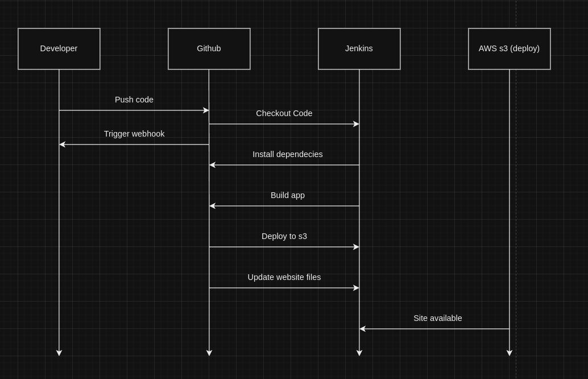

# Documentação do Projeto: Deploy Contínuo com Jenkins, React.js e AWS S3

---

### Índice

1. **Visão Geral do Projeto**
2. **Pré-requisitos**
3. **Configuração do Ambiente**
4. **Desenvolvimento e Testes**
5. **Pipeline de Deploy Contínuo**
6. **Configuração do Jenkins**
7. **Configuração do AWS S3**
8. **Monitoramento e Manutenção**
9. **Referências**

---

## 1. Visão Geral do Projeto

Este projeto tem como objetivo implementar uma solução de deploy contínuo para uma aplicação **React.js** utilizando o **Jenkins** para automação de CI/CD e o **AWS S3** como servidor de hospedagem de arquivos estáticos. A pipeline será configurada para que sempre que houver uma alteração no código no GitHub, o Jenkins execute o build da aplicação e faça o deploy no S3, garantindo que as atualizações estejam disponíveis no ambiente de produção.

**Tecnologias Utilizadas:**
- **React.js**: Framework para construção da interface do usuário.
- **GitHub**: Sistema de controle de versão e gerenciamento de código-fonte.
- **Jenkins**: Ferramenta de automação de integração contínua (CI) e entrega contínua (CD).
- **AWS S3**: Serviço de armazenamento de objetos, utilizado para hospedar o site estático.

---

## 2. Pré-requisitos

Antes de iniciar o processo de configuração do pipeline, certifique-se de que todos os pré-requisitos abaixo estão cumpridos:

- Conta GitHub e acesso ao repositório do projeto.
- **Jenkins** instalado no servidor local (Home Lab) e configurado com acesso à internet.
- **Node.js** (versão 14.x ou superior) e **npm** instalados no servidor Jenkins.
- Conta **AWS** com permissões para acessar e configurar buckets no **S3**.
- **AWS CLI** instalada no servidor Jenkins para interagir com os serviços da AWS.
- Acesso SSH ao servidor Jenkins para realizar a configuração e criação dos jobs.

---

## 3. Configuração do Ambiente

### 3.1 Clonando o Repositório

Clone o repositório do projeto no servidor Jenkins:

```bash
git clone https://github.com/usuario/repositorio.git
cd repositorio
```

### 3.2 Instalando Dependências

No servidor Jenkins, navegue até o diretório do projeto e instale as dependências da aplicação:

```bash
npm install
```

---

## 4. Desenvolvimento e Testes

### 4.1 Desenvolvimento Local

Antes de configurar o pipeline, é importante garantir que o desenvolvimento local e os testes estão funcionando corretamente. Para iniciar o servidor de desenvolvimento, use:

```bash
npm start
```

### 4.2 Rodando Testes

Execute os testes da aplicação (se configurados):

```bash
npm test
```

---

## 5. Pipeline de Deploy Contínuo

### 5.1 Visão Geral do Pipeline

O pipeline de **Deploy Contínuo** é automatizado via Jenkins, com as seguintes etapas:

1. **Checkout do Código**: Jenkins faz o download da última versão do código do repositório GitHub.
2. **Instalação de Dependências**: Jenkins instala todas as dependências da aplicação React.js.
3. **Build da Aplicação**: Jenkins gera a versão de produção da aplicação.
4. **Deploy para o AWS S3**: Os arquivos estáticos gerados no build são enviados para um bucket do AWS S3, tornando a aplicação acessível via um endpoint público.

### 5.2 Diagrama de Fluxo



---

## 6. Configuração do Jenkins

### 6.1 Criando um Job no Jenkins

1. Acesse o **Jenkins** no servidor local.
2. Crie um novo **Pipeline Job** e configure as seguintes etapas:

- **Checkout do Código**:
  Use o plugin **Git** para integrar com o repositório do GitHub.

- **Instalação das Dependências e Build**:
  Configure o pipeline para rodar os seguintes comandos:
  
  ```bash
  npm install
  npm run build
  ```

- **Deploy para o AWS S3**:
  Configure o Jenkins para usar o **AWS CLI** para sincronizar os arquivos gerados com o S3:

  ```bash
  aws s3 sync ./build s3://<nome-do-bucket-s3> --delete
  ```

Substitua `<nome-do-bucket-s3>` pelo nome do seu bucket S3.

### 6.2 Configuração de Credenciais

Configure as credenciais da AWS no Jenkins para garantir acesso ao S3. Vá em **Gerenciar Jenkins** > **Gerenciar Credenciais** e adicione as chaves de acesso da AWS.

---

## 7. Configuração do AWS S3

### 7.1 Criando o Bucket S3

1. No console da AWS, acesse o **S3** e crie um novo **bucket**.
2. Certifique-se de configurar o bucket para ser público, permitindo o acesso HTTP aos arquivos estáticos.

### 7.2 Configuração de Políticas de Acesso

Adicione uma política de acesso ao bucket que permita a leitura pública dos arquivos estáticos da aplicação:

```json
{
  "Version": "2012-10-17",
  "Statement": [
    {
      "Sid": "PublicReadGetObject",
      "Effect": "Allow",
      "Principal": "*",
      "Action": "s3:GetObject",
      "Resource": "arn:aws:s3:::<nome-do-bucket-s3>/*"
    }
  ]
}
```

---

## 8. Monitoramento e Manutenção

## 8. Monitoramento e Manutenção

### 8.1 Monitoramento da Pipeline no Jenkins

O monitoramento da pipeline é feito através do Jenkins, onde todas as execuções podem ser acompanhadas na aba **Builds**. Em caso de falhas, os logs do Jenkins devem ser consultados para identificar e corrigir problemas. 

### 8.2 Monitoramento com Portainer

Além do Jenkins, o **Portainer** também é utilizado no **Home Lab** para monitorar os containers e a infraestrutura Docker. O Portainer fornece uma interface gráfica que facilita a gestão e o acompanhamento do estado dos containers, permitindo:

- **Monitoramento em tempo real** do status dos containers e dos recursos utilizados (CPU, memória, rede, etc.).
- **Gestão de containers** Docker, permitindo a reinicialização ou parada manual dos serviços se necessário.
- **Logs em tempo real** dos containers para auxiliar na análise de problemas.
  
### 8.3 Manutenção do Ambiente

Além do monitoramento contínuo, é importante realizar a manutenção periódica dos seguintes componentes:
- **Bucket S3**: Verificar permissões e se o conteúdo está sendo servido corretamente.
- **Pipeline Jenkins**: Garantir que a pipeline esteja atualizada com as dependências e que não haja erros nos jobs.
- **Containers no Portainer**: Monitorar o uso de recursos dos containers e verificar se há necessidade de ajuste na infraestrutura Docker para evitar sobrecarga.

---

## 9. Referências

- [Documentação do Jenkins](https://www.jenkins.io/doc/)
- [Documentação do AWS S3](https://docs.aws.amazon.com/s3/index.html)
- [Documentação do React.js](https://reactjs.org/docs/getting-started.html)